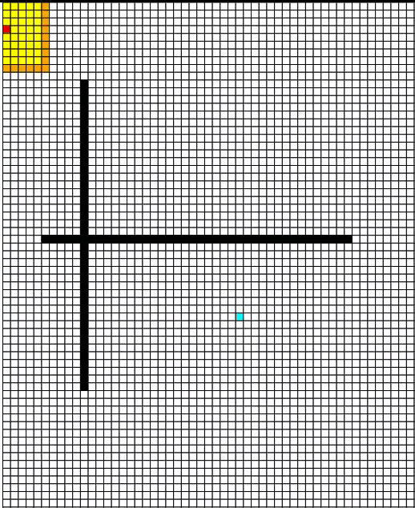
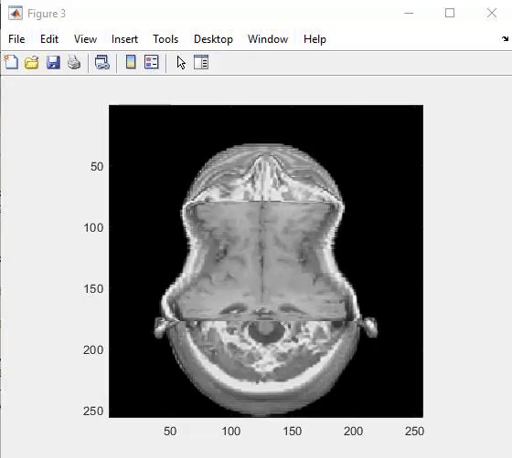
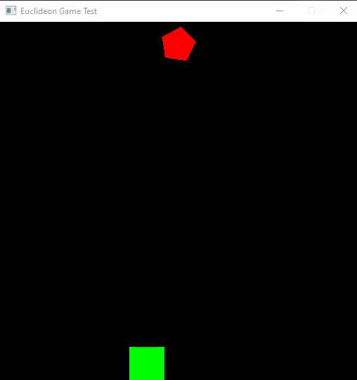

# Oliver Mainey's Computer Science Portfolio 
(Updated 23rd November 2020)  

## Gravity (C++, SFML, ImGui, SIMD)  
Gravitational simulation focused on both speed and visualization.  
[More Gifs on the Project Page!](https://github.com/ober3550/SolarSim)  
  
   

## Fluid Sim Project (C++, SFML, ImGui)  
Fluid sim project inspired by Fluid Simulation for Dummies by Mike Ash  
[Check out the Project Page](https://github.com/ober3550/FluidSim)  
  

## RoboFactory Game (C++, SFML, ImGui)  
Learning the importance of planning, long term project management and motivation toward a goal.  
[Check Out The Project for More!](https://github.com/ober3550/RobotComplex)  
  
  
  
  
  
  
  

## Factorio Mods (Lua)
Creating many multi-faceted modules that interact with a potentially infinite number of other modules is a challenge in dependency and future planning.  
https://mods.factorio.com/user/ober3550  

## Wave Equation (Matlab)  
  
   

## Leetcode Algorithm Practice
https://leetcode.com/ober3550  

## One day Builds
### Tetris (P5.js)
https://github.com/Ober3550/BlockGame  
  

### Pathfinder (P5.js)
https://github.com/Ober3550/Pathfinder  
  
  

### 2048 Game (P5.js)

### Off axis bouncing (P5.js)

### Ninja Platformer (P5.js)
https://github.com/Ober3550/NinjaGame  
  

## Misc  
### Matlab  
  
### Matlab  
  
### C++ SDL2  
  
